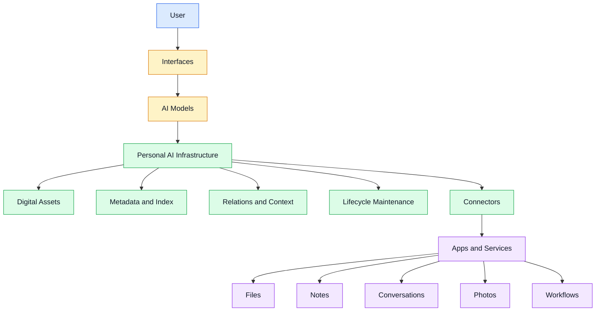

# Personal AI Infrastructure

### **AI changes. Your digital life shouldn't.**

---

## 🌐 What Is This?

This repository is a public design and engineering log for exploring one question:

> **Can a person's digital life exist independently of any AI company, while still being usable by any AI system?**

AI models will keep changing.

Today it may be ChatGPT.  
Tomorrow it may be Claude, Gemini, DeepSeek, or something completely new.

But personal digital assets should not be locked inside any single AI product.

Files, notes, conversations, projects, photos, workflows, decisions, and digital history should belong to the user.

---

## 🧠 Core Idea

Personal AI Infrastructure is not another AI assistant.

It is the infrastructure beneath AI assistants, cloud drives, note-taking apps, automation tools, and personal knowledge systems.

The basic idea is:

| Layer | Responsibility |
|---|---|
| **Applications** | Create digital assets |
| **Infrastructure** | Maintain, organize, and connect assets |
| **AI Models** | Understand and use context when needed |
| **User** | Owns the data, structure, and final authority |

In short:

> **Applications produce data.  
> Infrastructure gives it continuity.  
> AI helps use it.  
> The user owns it.**

---

## 🧩 Architecture Direction

---

## ✨ Why This Matters

Most AI products try to make the model remember more about the user.

But if memory and context stay inside one AI product, the user becomes dependent on that product.

When the model changes, the user's context may disappear.  
When the company changes its rules, the user's digital history may become trapped.  
When the product shuts down, the user's accumulated structure may be lost.

This project starts from a different assumption:

> **AI should not own personal memory or digital assets.**

AI should access user-owned context through a controlled infrastructure.

The infrastructure should outlive any single model, app, or company.

---

## 🗂️ What This Project Focuses On

### 1. Digital Assets

Personal data should be treated as digital assets, not random files.

An asset may be:

- document
- image
- screenshot
- note
- conversation
- project file
- video
- code repository
- exported archive
- workflow record

---

### 2. Metadata and Indexing

Assets should carry information about:

- where they came from
- when they entered the system
- what they contain
- how they can be searched
- whether they are temporary, active, archived, or deleted

---

### 3. Relations and Context

Assets should not remain isolated.

A document may belong to a project.  
A conversation may explain a decision.  
A screenshot may capture an idea.  
A note may connect to a future plan.

The infrastructure should help these scattered traces become a connected structure.

---

### 4. Lifecycle Maintenance

Digital assets change over time.

Some assets are temporary.  
Some are active.  
Some are project-related.  
Some should be archived.  
Some should be deleted.  
Some should become part of long-term personal knowledge.

The system should not only store assets.

It should maintain them.

---

### 5. AI-Assisted Understanding

AI can help:

- summarize assets
- classify documents
- suggest tags
- detect duplicates
- discover relationships
- retrieve context
- explain why something may matter

But AI should assist the infrastructure.

It should not own the data, the structure, or the final authority.

---

## 🧭 Current Questions

This repository is currently exploring:

- Should AI own memory, or only access user-owned context?
- How should personal digital assets enter the system?
- How should assets be indexed, tagged, summarized, and updated?
- How should asset lifecycle be managed over time?
- How can privacy and permission control be built into the system?
- What should a self-hosted personal infrastructure look like?
- How can different AI models use the same personal context without locking the user in?

---

## 🛣️ Roadmap

| Stage | Focus | Status |
|---|---|---|
| **Stage 0** | Concept and design notes | 🟢 In progress |
| **Stage 1** | Digital asset model | 🟡 Planned |
| **Stage 2** | Minimal local infrastructure | ⚪ Not started |
| **Stage 3** | Connectors and imports | ⚪ Not started |
| **Stage 4** | AI-assisted maintenance | ⚪ Not started |

---

## 📌 Design Notes

The project is currently documented as a continuous thinking process.

| No. | Title | Topic |
|---|---|---|
| 001 | Why I Want to Build Personal AI Infrastructure | Motivation |
| 002 | What Is Personal AI Infrastructure? | Architecture |
| 003 | How Digital Life Enters Personal AI Infrastructure | Data entry |
| 004 | How Should Personal Infrastructure Maintain Digital Assets? | Asset lifecycle |

---

## 🧱 Principles

- **Ownership belongs to the user.**
- **AI models are replaceable.**
- **Digital assets should not be locked inside AI products.**
- **Infrastructure should outlive individual models and applications.**
- **Raw data and structured understanding should be separated.**
- **AI should assist, not own.**
- **Privacy comes before convenience.**
- **Deletion and cleanup are part of asset maintenance.**
- **The system should be traceable, controllable, and explainable.**

---

## 🚧 Status

This is an early-stage research and engineering log.

There is no final answer yet.

The current focus is:

> **Architecture first. Implementation second.**

Ideas, mistakes, design decisions, and prototypes will be documented here.

---

## Philosophy

### **Own your digital life. Let any AI work for you.**

