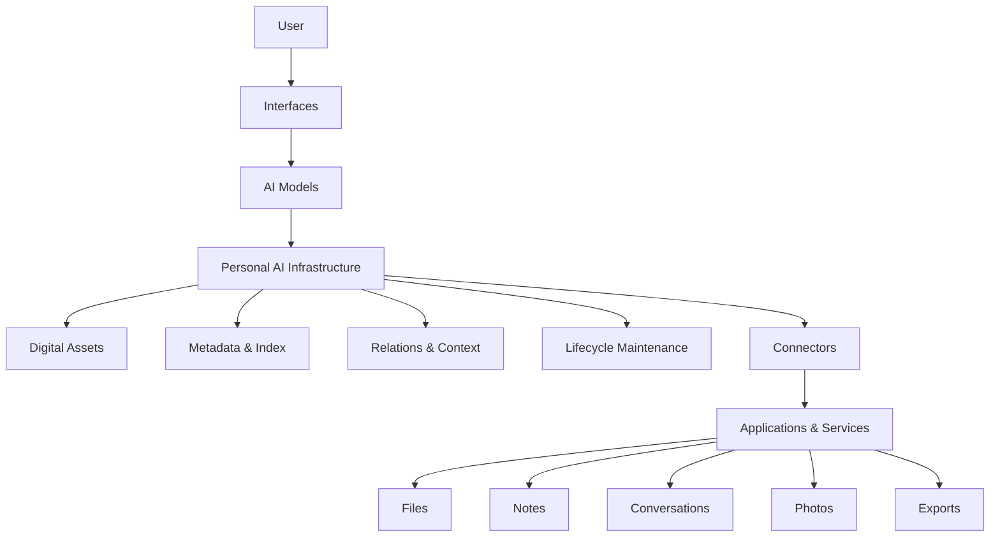

# Architecture

Status: Early Draft  
Last updated: 2026-07-03

This document describes the current architecture direction of **Personal AI Infrastructure**.

It is not a final technical design.

The goal is to clarify the main responsibilities and boundaries before implementation begins.

---

## Core Separation

Personal AI Infrastructure is based on one basic separation:

> Applications produce digital assets.  
> Infrastructure maintains and organizes them.  
> AI models help understand and use them.  
> The user owns the data, structure, and final authority.

AI models may change.

Applications may change.

Interfaces may change.

But the user's digital assets and context should remain under user control.

---

## High-Level Flow

---

## Main Layers

### User

The user owns the data, permissions, structure, and final decisions.

The system should help the user manage digital life, not take control away from the user.

---

### Interfaces

Interfaces are how the user interacts with the system.

They may include chat interfaces, web dashboards, mobile apps, command line tools, or future agents.

Interfaces should be replaceable.

Jarvis may become one interface, but it should not be the infrastructure itself.

---

### AI Models

AI models are responsible for reasoning and understanding.

They may summarize, classify, retrieve context, suggest tags, and help the user make decisions.

But AI models should not own personal data.

They should only access the context they need through the infrastructure.

---

### Personal AI Infrastructure

The infrastructure is the stable core layer.

It maintains digital assets over time.

It may manage:

- assets;
- metadata;
- indexes;
- relations;
- lifecycle states;
- permissions;
- traceability.

The infrastructure should outlive any single AI model, application, or company.

---

### Digital Assets

A digital asset is any user-owned digital object that may have context or long-term value.

Examples include:

- documents;
- screenshots;
- notes;
- conversations;
- images;
- videos;
- code repositories;
- exported archives;
- project files.

A digital asset is more than a file.

It may have a source, time, context, related project, lifecycle state, tags, evidence, and history.

---

### Connectors

Connectors bring data from applications and services into the infrastructure.

Possible sources include:

- local folders;
- official exports;
- cloud drives;
- note-taking apps;
- email;
- photos;
- chat applications;
- self-hosted services.

Connectors should translate external data into the infrastructure's asset model.

They should not own the data or the final structure.

---

## What This System Is Not

Personal AI Infrastructure is not:

- a single AI assistant;
- a chatbot memory feature;
- a cloud drive replacement;
- a note-taking app replacement;
- a file manager with AI added on top;
- a system that secretly collects all user data.

It is a user-owned infrastructure layer for digital assets, context, lifecycle, and AI-assisted understanding.

---

## Current Open Questions

This architecture is still early.

Important questions remain:

- What should the first asset model look like?
- What data source should the first prototype support?
- How should raw data and structured metadata be separated?
- How should permissions be represented?
- How should AI access only the context it needs?
- How should lifecycle states be defined?
- What should be self-hosted first?

These questions should be answered gradually through design notes and prototypes.

---

## Current Understanding

The goal is not to build the smartest AI assistant first.

The goal is to build a stable foundation where personal digital assets can enter, be maintained, and remain usable by different AI systems over time.

AI is replaceable.

Applications are replaceable.

Interfaces are replaceable.

The user's digital life should not be.
