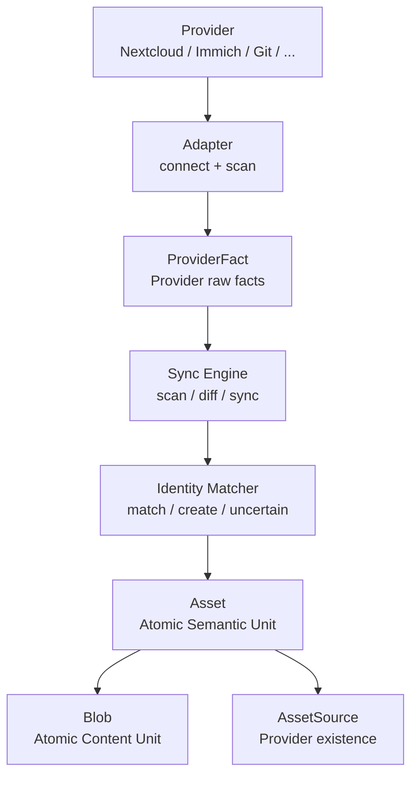

# 02 - World Model V0.1

## Status

V0.1 Frozen.

## Core Idea

PDI does not mirror Provider databases.

PDI builds its own World Model from Provider Facts.

## Flow



## Asset

Asset is the smallest semantic unit in PDI V0.1.

In V0.1, Asset must come from a Provider.

Examples:

- a document
- a photo
- a video
- an email
- a message
- a Git file or commit

Asset is not a file path.

Asset is not a Provider record.

Asset is not a Blob.

## Blob

Blob is the smallest content unit.

Blob represents actual content.

Examples:

- docx content
- pdf content
- jpg content
- mp4 content
- message body content

One Asset can have multiple Blobs.

Example:

```text
Asset: Graduation Thesis
├── Blob: thesis.docx
├── Blob: thesis.pdf
└── Blob: thesis.md
```

Blob is not split further in V0.1.

## AssetSource

AssetSource records where an Asset exists in a Provider.

Example:

```text
Asset: Graduation Thesis
├── AssetSource: Nextcloud / Documents/thesis.docx
├── AssetSource: Google Drive / thesis.docx
└── AssetSource: Local Disk / ~/Documents/thesis.docx
```

AssetSource answers:

> Where can this Asset be found?

## ProviderFact

ProviderFact is the raw fact returned by Adapter.

ProviderFact does not directly become a database record.

ProviderFact must go through Sync Engine and Identity Matcher.

## Sync Engine

Sync Engine decides when and how to scan Providers.

It compares current ProviderFacts with previous state.

It detects:

- new
- changed
- deleted
- unchanged

## Identity Matcher

Identity Matcher decides whether a ProviderFact should:

- create a new Asset
- match an existing Asset
- stay uncertain

## V0.1 Boundary

V0.1 does not include Collection as an entity.

Collection-like behavior should be represented by Relation later.

V0.1 does not include Metadata as an independent entity.

Metadata lives as attributes on Asset, Blob, or AssetSource.

V0.1 does not treat abstract life events like "UK exchange" as Asset yet.

That may be introduced in a later version.